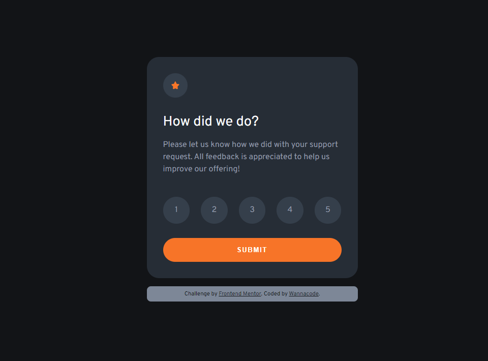

# Frontend Mentor - Interactive rating component solution

This is a solution to the [Interactive rating component challenge on Frontend Mentor](https://www.frontendmentor.io/challenges/interactive-rating-component-koxpeBUmI). Frontend Mentor challenges help you improve your coding skills by building realistic projects. 

## Table of contents

- [Overview](#overview)
  - [The challenge](#the-challenge)
  - [Screenshot](#screenshot)
  - [Links](#links)
- [My process](#my-process)
  - [Built with](#built-with)
  - [What I learned](#what-i-learned)
  - [Continued development](#continued-development)
- [Author](#author)

## Overview

### The challenge

Users should be able to:

- View the optimal layout for the app depending on their device's screen size
- See hover states for all interactive elements on the page
- Select and submit a number rating
- See the "Thank you" card state after submitting a rating

### Screenshot

### Links

- Solution URL: [Solution is here](https://github.com/kwngptrl/FEM-interactive-rating-component)
- Live Site URL: [Live site](https://kwngptrl.github.io/FEM-interactive-rating-component/)

## My process

This is my first challenge to work with HTML, CSS and JS in combination. It was a bit confusing at first. Looking at the design images, there is definitely a radiobutton group. But what to do with... Is this a multi-page site? Nothing in the description says so. If it's only all on one page then it must utilize 'display:none' in CSS. But will that impact accessibilty? Querying Google says it's not necessarily so.

Okay. Now, I have to figure out how to style the radiobuttons. Lots of hints on YouTube. Found one and proceeded to dissect it and understand it. Again, CSS is not as intuitive as it's supposed to be. Then, the JS, found some stuff, but not working as expected. I managed to get it to work however. Later, I found my code to be very similar to the example in MDN.

### Built with

- Semantic HTML5 markup
- CSS custom properties
- Flexbox
- CSS Grid
- Mobile-first workflow

### What I learned

I had to add an additional color to those provided, as those provided were not enough to faithfully render the project when compared with the provided scheenshots.

The assigned font 'Overpass' was not centering itself when in responsive mode. The problem was noted by someone here: [Text moves on devices in responsive design](https://www.sitepoint.com/community/t/text-moves-on-devices-in-responsive-design/306160). It is unrelated to this Frontendmentor challenge.

My first use of the gap property in flexbox. Still, it does not solve all placement problems as I had to still use some margin/padding to get it to closely match the design.

Trying to get HTML input validation along with JS was a bit tricky for me. It was not working as expected. Since the form was not being submitted to a server, using a type 'submit' in addEventListener part would not work. It has to be 'click'.

### Continued development

It would be great to define a fixed sized card for this. But I don't know if that is good practice. There's probably another way to style those radiobuttons to do the same thing. I might revisit this challenge again someday.

## Author

- Website - [Add your name here](https://www.your-site.com)
- Frontend Mentor - [@Wannacode](https://www.frontendmentor.io/profile/kwngptrl)

